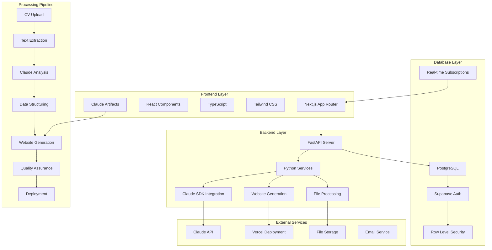

# Product Requirements Document: CV-to-Website Automation System

## **1. Executive Summary**

### **Primary Value Propositions**
- **Automated CV Processing**: Transform static resumes into dynamic, professional web portfolios in minutes instead of hours
- **AI-Powered Intelligence**: Leverage Claude SDK's advanced document processing and code generation capabilities for intelligent automation
- **Human-Supervised Quality**: Combine AI efficiency with human expertise to ensure professional-grade outputs
- **Scalable Workflow**: Process multiple CVs simultaneously while maintaining quality and customization
- **Cost-Effective Solution**: Reduce development costs by 70% compared to traditional manual website creation

### **Strategic Alignment**
This system addresses the growing demand for professional online presence while solving the bottleneck of manual CV processing and website development. It aligns with modern recruitment practices, digital transformation initiatives, and the need for scalable, AI-assisted workflows.

### **Core Benefits**
- **For Job Seekers**: Instant professional web presence with personalized branding and modern design
- **For HR Professionals**: Streamlined candidate evaluation with standardized, searchable portfolios
- **For Organizations**: Reduced time-to-hire and improved candidate experience
- **For Developers**: Automated code generation with human oversight for quality assurance

### **Success Definition**
- Process CVs to structured data with 95%+ accuracy
- Generate deployable websites within 10 minutes of CV upload
- Achieve 90%+ user satisfaction with generated portfolios
- Reduce manual website development time by 80%
- Maintain security and accessibility standards in all generated code

## **2. Scope Definition**

### **In Scope**
1. **Multi-format CV Ingestion**: Support for PDF, DOCX, and TXT files with robust text extraction
2. **Intelligent Data Extraction**: Extract and structure personal info, work experience, education, skills, and contact details
3. **Modular Website Generation**: Create responsive, modern web portfolios using Next.js and React
4. **Real-time Preview & Iteration**: Interactive Artifacts-based prototyping with immediate visual feedback
5. **Automated Deployment**: One-click deployment to Vercel, Netlify, or GitHub Pages
6. **Quality Assurance Pipeline**: Automated testing, security scanning, and human review workflows
7. **Version Control Integration**: Git-based tracking of all generated assets and iterations

### **Out of Scope**
1. **Complex Backend Applications**: No custom server-side logic or database integration beyond basic portfolio features
2. **E-commerce Functionality**: No payment processing, shopping carts, or inventory management
3. **Real-time Collaboration**: No multi-user editing or live collaboration features
4. **Advanced Analytics**: No complex user behavior tracking or business intelligence features
5. **Mobile App Generation**: No native mobile application development

### **Future Considerations**
- **AI-Powered Content Enhancement**: Automatic generation of professional summaries and skill descriptions
- **Multi-language Support**: Internationalization for global candidate pools
- **Advanced Customization**: AI-driven design variations and branding options
- **Integration APIs**: Connect with ATS systems and recruitment platforms
- **Performance Optimization**: Advanced caching and CDN integration

## **3. Target Market & User Analysis**

### **3.1 Ideal Customer Profile (ICP)**

**Company Characteristics**
- **Size**: Mid to large enterprises (500+ employees)
- **Industry**: Technology, consulting, finance, healthcare, and professional services
- **Revenue**: $50M+ annual revenue
- **Geographic Location**: North America, Europe, and Asia-Pacific regions
- **Technology Profile**: Modern tech stack with cloud infrastructure, API-first architecture
- **Business Context**: High-volume recruitment, digital transformation initiatives, employer branding focus
- **Success Criteria**: Reduced time-to-hire, improved candidate experience, enhanced employer brand

### **3.2 User Personas**

**Persona 1: HR Technology Manager (Sarah)**
- **Demographics & Role**: 35-45 years old, HR Technology Manager, oversees recruitment systems
- **Goals & Motivations**: Streamline recruitment processes, improve candidate experience, reduce manual workload
- **Pain Points**: Time-consuming CV processing, inconsistent candidate presentations, limited technical resources
- **Technical Proficiency**: Intermediate - comfortable with HRIS systems and basic technical concepts
- **Decision Influence**: High - makes purchasing decisions for recruitment technology

**Persona 2: Recruiter (Mike)**
- **Demographics & Role**: 28-35 years old, Senior Recruiter, manages high-volume hiring
- **Goals & Motivations**: Efficient candidate evaluation, professional candidate presentation, quick decision-making
- **Pain Points**: Manual CV parsing, inconsistent candidate data, time spent on administrative tasks
- **Technical Proficiency**: Basic - uses recruitment software and basic office tools
- **Decision Influence**: Medium - provides input on tool selection and workflow improvements

**Persona 3: Job Seeker (Alex)**
- **Demographics & Role**: 25-35 years old, Professional seeking career advancement
- **Goals & Motivations**: Stand out to employers, showcase skills effectively, maintain professional online presence
- **Pain Points**: Limited web development skills, time constraints, cost of professional website development
- **Technical Proficiency**: Basic - comfortable with social media and basic web tools
- **Decision Influence**: Low - typically uses tools provided by employers or recruitment agencies

**Persona 4: Web Developer (Jordan)**
- **Demographics & Role**: 30-40 years old, Full-stack Developer, builds recruitment tools
- **Goals & Motivations**: Efficient development workflows, maintainable code, scalable solutions
- **Pain Points**: Repetitive portfolio development, inconsistent code quality, time spent on basic tasks
- **Technical Proficiency**: Advanced - expert in modern web technologies and development practices
- **Decision Influence**: High - makes technical decisions and evaluates development tools

## **4. User Stories & Acceptance Criteria**

### **4.1 Core User Stories**

**As an HR Technology Manager, I want to upload multiple CVs simultaneously so that I can process large candidate pools efficiently.**
- **Acceptance Criteria**: 
  - System accepts batch uploads of 10+ CV files
  - Progress indicator shows processing status for each file
  - Error handling for corrupted or unsupported file formats
  - Structured data output in consistent JSON format

**As a Recruiter, I want to view candidate information in a structured, searchable format so that I can quickly evaluate qualifications.**
- **Acceptance Criteria**:
  - Extracted data organized into clear sections (experience, education, skills)
  - Search functionality across all candidate data
  - Filter options by skills, experience level, education
  - Export capabilities for candidate data

**As a Job Seeker, I want my CV automatically converted to a professional website so that I can showcase my qualifications effectively.**
- **Acceptance Criteria**:
  - Modern, responsive design that works on all devices
  - Professional color schemes and typography
  - All CV information accurately transferred to website
  - Contact information and social media links included

**As a Web Developer, I want to review and customize AI-generated code so that I can ensure quality and add custom features.**
- **Acceptance Criteria**:
  - Clean, well-structured code following best practices
  - Comprehensive documentation and comments
  - Easy customization of design and functionality
  - Version control integration for tracking changes

### **4.2 Detailed User Flows**

**Primary Workflow: CV Processing to Website Generation**

1. **CV Upload & Validation**
   - User uploads CV file(s) through web interface
   - System validates file format and size
   - Pre-processing extracts clean text using specialized libraries
   - Claude SDK analyzes content and extracts structured data

2. **Data Extraction & Structuring**
   - Claude processes extracted text using advanced prompt engineering
   - System generates structured JSON with personal info, experience, skills
   - Data validation ensures completeness and accuracy
   - Human review option for quality assurance

3. **Website Component Generation**
   - Claude generates modular React components based on structured data
   - Artifacts feature provides real-time visual preview
   - Iterative refinement through conversational prompts
   - Component assembly into complete Next.js application

4. **Quality Assurance & Deployment**
   - Automated testing of generated code
   - Security scanning for vulnerabilities
   - Human review and approval workflow
   - One-click deployment to hosting platform

**Success Scenarios**
- Complete workflow executed in under 10 minutes
- Generated website meets accessibility standards
- All CV information accurately represented
- Professional design with modern aesthetics
- Mobile-responsive and cross-browser compatible

**Edge Cases**
- CVs with complex layouts or embedded images
- Multiple language support and character encoding
- Large files exceeding API limits
- Network failures during processing
- Invalid or corrupted file uploads

## **5. Feature Specifications**

### **5.1 Feature Hierarchy**

**Critical Features**

1. **CV Document Processing Engine**
   - **Feature Overview**: Robust extraction of text and structure from various CV formats
   - **Priority**: Critical
   - **Complexity**: Complex
   - **User Value Score**: 10/10
   - **Business Justification**: Core functionality required for system operation

2. **Claude SDK Integration**
   - **Feature Overview**: Central AI engine for semantic understanding and code generation
   - **Priority**: Critical
   - **Complexity**: Very Complex
   - **User Value Score**: 10/10
   - **Business Justification**: Differentiates solution with advanced AI capabilities

3. **Website Generation Pipeline**
   - **Feature Overview**: Automated creation of professional web portfolios
   - **Priority**: Critical
   - **Complexity**: Complex
   - **User Value Score**: 10/10
   - **Business Justification**: Primary value proposition for end users

**High Priority Features**

4. **Interactive Artifacts Preview**
   - **Feature Overview**: Real-time visual feedback for rapid iteration
   - **Priority**: High
   - **Complexity**: Moderate
   - **User Value Score**: 9/10
   - **Business Justification**: Accelerates development cycle and improves user experience

5. **Quality Assurance Workflow**
   - **Feature Overview**: Automated testing and human review processes
   - **Priority**: High
   - **Complexity**: Moderate
   - **User Value Score**: 8/10
   - **Business Justification**: Ensures production-ready outputs and reduces risk

**Medium Priority Features**

6. **Batch Processing**
   - **Feature Overview**: Handle multiple CVs simultaneously
   - **Priority**: Medium
   - **Complexity**: Moderate
   - **User Value Score**: 7/10
   - **Business Justification**: Improves efficiency for high-volume users

7. **Deployment Automation**
   - **Feature Overview**: One-click deployment to various hosting platforms
   - **Priority**: Medium
   - **Complexity**: Simple
   - **User Value Score**: 7/10
   - **Business Justification**: Reduces friction in getting websites live

### **5.2 Detailed Requirements**

**CV Document Processing Engine**

**Functional Specifications**
- Accept PDF, DOCX, and TXT files up to 32MB
- Extract text while preserving structural information
- Handle complex layouts, tables, and embedded images
- Support multiple languages and character encodings
- Generate structured JSON output with predefined schema

**User Interface Requirements**
- Drag-and-drop file upload interface
- Progress indicators for processing status
- Error messages for unsupported formats
- Preview of extracted text before processing

**Data Requirements**
```json
{
  "personal_info": {
    "name": "string",
    "email": "string",
    "phone": "string",
    "location": "string",
    "linkedin": "string"
  },
  "experience": [
    {
      "title": "string",
      "company": "string",
      "duration": "string",
      "description": "string",
      "achievements": ["string"]
    }
  ],
  "education": [
    {
      "degree": "string",
      "institution": "string",
      "year": "string",
      "gpa": "string"
    }
  ],
  "skills": {
    "technical": ["string"],
    "soft_skills": ["string"],
    "languages": ["string"]
  }
}
```

**Business Rules**
- Validate email format and phone number structure
- Normalize company names and job titles
- Extract skills from experience descriptions
- Calculate total years of experience
- Identify and categorize technical vs. soft skills

**Integration Points**
- PyMuPDF for PDF processing
- python-docx for DOCX processing
- Claude SDK for semantic analysis
- JSON schema validation libraries

**Performance Requirements**
- Process single CV within 30 seconds
- Handle batch of 10 CVs within 5 minutes
- 99.9% uptime for processing pipeline
- Support concurrent processing of 50+ files

**Claude SDK Integration**

**Functional Specifications**
- Initialize Claude client with API authentication
- Implement structured output using tool schemas
- Handle context window management for large documents
- Process streaming responses for real-time feedback
- Implement retry logic for API failures

**User Interface Requirements**
- API key management interface
- Usage monitoring and cost tracking
- Model selection options (Opus, Sonnet, Haiku)
- Error handling for API rate limits

**Data Requirements**
- Claude API credentials and configuration
- Prompt templates for different CV sections
- Tool schemas for structured output
- Conversation history for context management

**Business Rules**
- Use Claude 3.5 Sonnet for optimal cost-performance balance
- Implement prompt caching for common instructions
- Break large documents into manageable chunks
- Validate outputs against expected schemas

**Integration Points**
- Anthropic Python SDK
- Prompt engineering framework
- JSON schema validation
- Error handling and logging systems

**Performance Requirements**
- API response time under 10 seconds
- Handle 1000+ API calls per hour
- Implement exponential backoff for retries
- Monitor token usage for cost optimization

**Website Generation Pipeline**

**Functional Specifications**
- Generate Next.js application with App Router
- Create responsive React components
- Implement modern CSS with Tailwind
- Include SEO optimization and metadata
- Support custom domain configuration

**User Interface Requirements**
- Real-time preview using Claude Artifacts
- Design customization options
- Component-level editing interface
- Mobile and desktop preview modes

**Data Requirements**
- Structured CV data from processing pipeline
- Design templates and component libraries
- SEO metadata and social media tags
- Deployment configuration settings

**Business Rules**
- Follow Next.js 14+ best practices
- Implement responsive design principles
- Ensure accessibility compliance (WCAG 2.1)
- Optimize for Core Web Vitals

**Integration Points**
- Next.js framework and build tools
- Tailwind CSS for styling
- Vercel/Netlify deployment APIs
- Git version control systems

**Performance Requirements**
- Generate complete website within 5 minutes
- Lighthouse performance score >90
- Mobile-first responsive design
- Fast loading times (<3 seconds)

## **6. Technical Architecture & Implementation**

### **6.1 Technology Stack & Architecture Decisions**

**Frontend Framework: Next.js 14 with App Router**
- **Rationale**: Server-side rendering, excellent SEO, built-in optimization, and modern React patterns
- **Benefits**: Automatic code splitting, image optimization, API routes, and deployment simplicity

**Backend Solution: Python with FastAPI**
- **Rationale**: Excellent async support, automatic API documentation, type safety, and Claude SDK compatibility
- **Benefits**: High performance, easy testing, comprehensive validation, and modern Python ecosystem

**Database: PostgreSQL with Supabase**
- **Rationale**: Reliable relational database with excellent JSON support, real-time features, and built-in authentication
- **Benefits**: Row-level security, automatic backups, real-time subscriptions, and scalable infrastructure

**Authentication: Supabase Auth**
- **Rationale**: Built-in authentication with social providers, secure session management, and easy integration
- **Benefits**: JWT tokens, role-based access control, email verification, and password reset functionality

**Hosting & Infrastructure: Vercel + Supabase**
- **Rationale**: Optimized for Next.js deployment, global CDN, automatic scaling, and seamless integration
- **Benefits**: Zero-config deployment, automatic HTTPS, edge functions, and excellent developer experience

**Development Tools: TypeScript, ESLint, Prettier**
- **Rationale**: Type safety, code quality enforcement, consistent formatting, and modern development practices
- **Benefits**: Reduced bugs, better IDE support, team collaboration, and maintainable codebase

### **6.2 Application Scaffolding & Structure**

```
cv2w-automation/
├── README.md
├── package.json
├── pyproject.toml
├── docker-compose.yml
├── .env.example
├── .gitignore
├── public/
│   ├── assets/
│   │   ├── images/
│   │   └── icons/
│   └── favicon.ico
├── src/
│   ├── app/                    # Next.js App Router
│   │   ├── (auth)/
│   │   │   ├── login/
│   │   │   └── register/
│   │   ├── dashboard/
│   │   │   ├── cv-upload/
│   │   │   ├── processing/
│   │   │   └── websites/
│   │   ├── api/
│   │   │   ├── auth/
│   │   │   ├── cv/
│   │   │   ├── claude/
│   │   │   └── deploy/
│   │   ├── globals.css
│   │   ├── layout.tsx
│   │   └── page.tsx
│   ├── components/
│   │   ├── ui/                 # Reusable UI components
│   │   │   ├── button.tsx
│   │   │   ├── input.tsx
│   │   │   ├── card.tsx
│   │   │   └── modal.tsx
│   │   ├── layout/             # Layout components
│   │   │   ├── header.tsx
│   │   │   ├── sidebar.tsx
│   │   │   └── footer.tsx
│   │   ├── forms/              # Form components
│   │   │   ├── cv-upload.tsx
│   │   │   └── website-config.tsx
│   │   └── features/           # Feature-specific components
│   │       ├── cv-processor/
│   │       ├── website-generator/
│   │       └── deployment/
│   ├── lib/
│   │   ├── database/           # Database client and queries
│   │   │   ├── client.ts
│   │   │   ├── schema.ts
│   │   │   └── queries/
│   │   ├── auth/               # Authentication utilities
│   │   │   ├── client.ts
│   │   │   └── middleware.ts
│   │   ├── claude/             # Claude SDK integration
│   │   │   ├── client.ts
│   │   │   ├── prompts/
│   │   │   └── tools/
│   │   ├── utils/              # Helper functions
│   │   │   ├── validation.ts
│   │   │   ├── formatting.ts
│   │   │   └── constants.ts
│   │   └── hooks/              # Custom React hooks
│   │       ├── use-cv-processing.ts
│   │       ├── use-website-generation.ts
│   │       └── use-deployment.ts
│   ├── types/                  # TypeScript definitions
│   │   ├── cv.ts
│   │   ├── website.ts
│   │   └── api.ts
│   └── styles/                 # Styling and themes
│       ├── components.css
│       └── themes/
├── backend/
│   ├── app/
│   │   ├── main.py
│   │   ├── config.py
│   │   ├── dependencies.py
│   │   ├── models/
│   │   │   ├── cv.py
│   │   │   ├── user.py
│   │   │   └── website.py
│   │   ├── services/
│   │   │   ├── cv_processor.py
│   │   │   ├── claude_service.py
│   │   │   └── website_generator.py
│   │   ├── api/
│   │   │   ├── v1/
│   │   │   │   ├── cv.py
│   │   │   │   ├── websites.py
│   │   │   │   └── deploy.py
│   │   │   └── dependencies.py
│   │   └── utils/
│   │       ├── file_handlers.py
│   │       ├── validators.py
│   │       └── helpers.py
│   ├── tests/
│   │   ├── test_cv_processor.py
│   │   ├── test_claude_service.py
│   │   └── test_website_generator.py
│   ├── requirements.txt
│   └── Dockerfile
├── database/
│   ├── migrations/
│   │   ├── 001_initial_schema.sql
│   │   └── 002_add_website_tables.sql
│   ├── seed.sql
│   └── schema.sql
└── docs/
    ├── api.md
    ├── deployment.md
    └── development.md
```

### **6.3 Database Schema Design**

```sql
-- Users table
CREATE TABLE users (
    id UUID PRIMARY KEY DEFAULT gen_random_uuid(),
    email VARCHAR(255) UNIQUE NOT NULL,
    full_name VARCHAR(255),
    avatar_url TEXT,
    created_at TIMESTAMP WITH TIME ZONE DEFAULT NOW(),
    updated_at TIMESTAMP WITH TIME ZONE DEFAULT NOW()
);

-- CV documents table
CREATE TABLE cv_documents (
    id UUID PRIMARY KEY DEFAULT gen_random_uuid(),
    user_id UUID REFERENCES users(id) ON DELETE CASCADE,
    original_filename VARCHAR(255) NOT NULL,
    file_path TEXT NOT NULL,
    file_size INTEGER NOT NULL,
    mime_type VARCHAR(100) NOT NULL,
    processing_status VARCHAR(50) DEFAULT 'pending',
    extracted_data JSONB,
    processing_errors TEXT[],
    created_at TIMESTAMP WITH TIME ZONE DEFAULT NOW(),
    updated_at TIMESTAMP WITH TIME ZONE DEFAULT NOW()
);

-- Structured CV data table
CREATE TABLE cv_data (
    id UUID PRIMARY KEY DEFAULT gen_random_uuid(),
    cv_document_id UUID REFERENCES cv_documents(id) ON DELETE CASCADE,
    personal_info JSONB NOT NULL,
    experience JSONB[],
    education JSONB[],
    skills JSONB NOT NULL,
    metadata JSONB,
    created_at TIMESTAMP WITH TIME ZONE DEFAULT NOW(),
    updated_at TIMESTAMP WITH TIME ZONE DEFAULT NOW()
);

-- Generated websites table
CREATE TABLE websites (
    id UUID PRIMARY KEY DEFAULT gen_random_uuid(),
    user_id UUID REFERENCES users(id) ON DELETE CASCADE,
    cv_data_id UUID REFERENCES cv_data(id) ON DELETE CASCADE,
    name VARCHAR(255) NOT NULL,
    description TEXT,
    domain VARCHAR(255),
    deployment_url TEXT,
    deployment_status VARCHAR(50) DEFAULT 'pending',
    website_config JSONB NOT NULL,
    generated_code JSONB,
    deployment_errors TEXT[],
    created_at TIMESTAMP WITH TIME ZONE DEFAULT NOW(),
    updated_at TIMESTAMP WITH TIME ZONE DEFAULT NOW()
);

-- Processing jobs table
CREATE TABLE processing_jobs (
    id UUID PRIMARY KEY DEFAULT gen_random_uuid(),
    user_id UUID REFERENCES users(id) ON DELETE CASCADE,
    job_type VARCHAR(50) NOT NULL,
    status VARCHAR(50) DEFAULT 'pending',
    input_data JSONB,
    output_data JSONB,
    error_message TEXT,
    started_at TIMESTAMP WITH TIME ZONE,
    completed_at TIMESTAMP WITH TIME ZONE,
    created_at TIMESTAMP WITH TIME ZONE DEFAULT NOW()
);

-- Row Level Security Policies
ALTER TABLE users ENABLE ROW LEVEL SECURITY;
ALTER TABLE cv_documents ENABLE ROW LEVEL SECURITY;
ALTER TABLE cv_data ENABLE ROW LEVEL SECURITY;
ALTER TABLE websites ENABLE ROW LEVEL SECURITY;
ALTER TABLE processing_jobs ENABLE ROW LEVEL SECURITY;

-- Users can only access their own data
CREATE POLICY "Users can view own data" ON users FOR SELECT USING (auth.uid() = id);
CREATE POLICY "Users can update own data" ON users FOR UPDATE USING (auth.uid() = id);

CREATE POLICY "Users can view own CV documents" ON cv_documents FOR SELECT USING (auth.uid() = user_id);
CREATE POLICY "Users can insert own CV documents" ON cv_documents FOR INSERT WITH CHECK (auth.uid() = user_id);
CREATE POLICY "Users can update own CV documents" ON cv_documents FOR UPDATE USING (auth.uid() = user_id);
CREATE POLICY "Users can delete own CV documents" ON cv_documents FOR DELETE USING (auth.uid() = user_id);

CREATE POLICY "Users can view own CV data" ON cv_data FOR SELECT USING (
    EXISTS (SELECT 1 FROM cv_documents WHERE cv_documents.id = cv_data.cv_document_id AND cv_documents.user_id = auth.uid())
);
CREATE POLICY "Users can insert own CV data" ON cv_data FOR INSERT WITH CHECK (
    EXISTS (SELECT 1 FROM cv_documents WHERE cv_documents.id = cv_data.cv_document_id AND cv_documents.user_id = auth.uid())
);

CREATE POLICY "Users can view own websites" ON websites FOR SELECT USING (auth.uid() = user_id);
CREATE POLICY "Users can insert own websites" ON websites FOR INSERT WITH CHECK (auth.uid() = user_id);
CREATE POLICY "Users can update own websites" ON websites FOR UPDATE USING (auth.uid() = user_id);
CREATE POLICY "Users can delete own websites" ON websites FOR DELETE USING (auth.uid() = user_id);

CREATE POLICY "Users can view own processing jobs" ON processing_jobs FOR SELECT USING (auth.uid() = user_id);
CREATE POLICY "Users can insert own processing jobs" ON processing_jobs FOR INSERT WITH CHECK (auth.uid() = user_id);

-- Indexes for performance
CREATE INDEX idx_cv_documents_user_id ON cv_documents(user_id);
CREATE INDEX idx_cv_documents_status ON cv_documents(processing_status);
CREATE INDEX idx_cv_data_document_id ON cv_data(cv_document_id);
CREATE INDEX idx_websites_user_id ON websites(user_id);
CREATE INDEX idx_websites_status ON websites(deployment_status);
CREATE INDEX idx_processing_jobs_user_id ON processing_jobs(user_id);
CREATE INDEX idx_processing_jobs_status ON processing_jobs(status);

-- Full-text search indexes
CREATE INDEX idx_cv_data_personal_info_gin ON cv_data USING GIN (personal_info);
CREATE INDEX idx_cv_data_experience_gin ON cv_data USING GIN (experience);
CREATE INDEX idx_cv_data_skills_gin ON cv_data USING GIN (skills);
```

### **6.4 API Design & Endpoints**

**Authentication Endpoints**
```
POST /api/auth/login
POST /api/auth/register
POST /api/auth/logout
GET /api/auth/me
POST /api/auth/refresh
```

**CV Processing Endpoints**
```
POST /api/v1/cv/upload
GET /api/v1/cv/{id}
GET /api/v1/cv/{id}/status
DELETE /api/v1/cv/{id}
GET /api/v1/cv/search?q={query}
```

**Website Generation Endpoints**
```
POST /api/v1/websites/generate
GET /api/v1/websites/{id}
PUT /api/v1/websites/{id}
DELETE /api/v1/websites/{id}
POST /api/v1/websites/{id}/deploy
GET /api/v1/websites/{id}/preview
```

**Claude Integration Endpoints**
```
POST /api/v1/claude/process-cv
POST /api/v1/claude/generate-website
POST /api/v1/claude/iterate-design
GET /api/v1/claude/status
```

**Request/Response Schemas**

**CV Upload Request**
```json
{
  "file": "multipart/form-data",
  "options": {
    "extract_images": true,
    "preserve_formatting": true,
    "language": "auto"
  }
}
```

**CV Upload Response**
```json
{
  "id": "uuid",
  "status": "processing",
  "filename": "resume.pdf",
  "file_size": 1024000,
  "estimated_completion": "2024-01-15T10:30:00Z"
}
```

**Website Generation Request**
```json
{
  "cv_data_id": "uuid",
  "template": "modern",
  "customization": {
    "color_scheme": "blue",
    "font_family": "inter",
    "layout": "single_page"
  },
  "features": {
    "contact_form": true,
    "social_links": true,
    "analytics": false
  }
}
```

**Website Generation Response**
```json
{
  "id": "uuid",
  "status": "generating",
  "preview_url": "https://preview.cv2w.com/uuid",
  "estimated_completion": "2024-01-15T10:35:00Z"
}
```

**Error Handling**
```json
{
  "error": {
    "code": "VALIDATION_ERROR",
    "message": "Invalid file format. Supported formats: PDF, DOCX, TXT",
    "details": {
      "field": "file",
      "value": "image.jpg"
    }
  }
}
```

**Rate Limiting**
- 100 requests per minute per user
- 1000 requests per hour per user
- 10 concurrent processing jobs per user

### **6.5 System Architecture Diagram**



## **7. Detailed Task Breakdown & Planning**

### **7.1 Development Tasks by Category**

**Infrastructure & Setup Tasks**

**Task ID: INF-001**
- **Name**: Project Initialization and Environment Setup
- **Description**: Set up development environment, install dependencies, configure tools
- **Acceptance Criteria**: All developers can run the project locally, linting and formatting work
- **Dependencies**: None
- **Effort Estimate**: S
- **Required Skills**: DevOps, Node.js, Python
- **Priority Level**: Critical

**Task ID: INF-002**
- **Name**: Database Schema Implementation
- **Description**: Create PostgreSQL database with Supabase, implement schema and migrations
- **Acceptance Criteria**: All tables created, RLS policies active, indexes optimized
- **Dependencies**: INF-001
- **Effort Estimate**: M
- **Required Skills**: PostgreSQL, SQL, Database Design
- **Priority Level**: Critical

**Task ID: INF-003**
- **Name**: Authentication System Setup
- **Description**: Implement Supabase Auth with Next.js integration
- **Acceptance Criteria**: Login/register working, protected routes, session management
- **Dependencies**: INF-002
- **Effort Estimate**: M
- **Required Skills**: Authentication, Next.js, Supabase
- **Priority Level**: Critical

**Frontend Development Tasks**

**Task ID: FE-001**
- **Name**: Core UI Components Library
- **Description**: Build reusable UI components with Tailwind CSS
- **Acceptance Criteria**: Button, Input, Card, Modal components with TypeScript
- **Dependencies**: INF-001
- **Effort Estimate**: M
- **Required Skills**: React, TypeScript, Tailwind CSS
- **Priority Level**: High

**Task ID: FE-002**
- **Name**: CV Upload Interface
- **Description**: Create drag-and-drop file upload with progress tracking
- **Acceptance Criteria**: File validation, progress indicators, error handling
- **Dependencies**: FE-001, INF-003
- **Effort Estimate**: L
- **Required Skills**: React, File Upload, API Integration
- **Priority Level**: High

**Task ID: FE-003**
- **Name**: Dashboard and Navigation
- **Description**: Build main dashboard with CV management and website generation
- **Acceptance Criteria**: List CVs, processing status, website management
- **Dependencies**: FE-001, FE-002
- **Effort Estimate**: L
- **Required Skills**: React, State Management, API Integration
- **Priority Level**: High

**Task ID: FE-004**
- **Name**: Website Preview and Customization
- **Description**: Integrate Claude Artifacts for real-time website preview
- **Acceptance Criteria**: Live preview, design customization, iteration interface
- **Dependencies**: FE-003, BE-003
- **Effort Estimate**: XL
- **Required Skills**: React, Claude SDK, Real-time Updates
- **Priority Level**: High

**Backend Development Tasks**

**Task ID: BE-001**
- **Name**: FastAPI Server Setup
- **Description**: Create FastAPI application with middleware and error handling
- **Acceptance Criteria**: Server running, health checks, logging, error handling
- **Dependencies**: INF-001
- **Effort Estimate**: S
- **Required Skills**: FastAPI, Python, API Design
- **Priority Level**: Critical

**Task ID: BE-002**
- **Name**: CV Processing Service
- **Description**: Implement file processing with PyMuPDF and python-docx
- **Acceptance Criteria**: Extract text from PDF/DOCX, handle errors, validate output
- **Dependencies**: BE-001, INF-002
- **Effort Estimate**: L
- **Required Skills**: Python, PDF Processing, File Handling
- **Priority Level**: Critical

**Task ID: BE-003**
- **Name**: Claude SDK Integration
- **Description**: Integrate Claude API for CV analysis and website generation
- **Acceptance Criteria**: Structured data extraction, code generation, error handling
- **Dependencies**: BE-002
- **Effort Estimate**: XL
- **Required Skills**: Claude SDK, Prompt Engineering, AI Integration
- **Priority Level**: Critical

**Task ID: BE-004**
- **Name**: Website Generation Engine
- **Description**: Create Next.js website generation with templates and customization
- **Acceptance Criteria**: Generate complete websites, template system, customization options
- **Dependencies**: BE-003
- **Effort Estimate**: XL
- **Required Skills**: Next.js, React, Code Generation
- **Priority Level**: Critical

**Task ID: BE-005**
- **Name**: Deployment Automation
- **Description**: Implement Vercel deployment with custom domains
- **Acceptance Criteria**: One-click deployment, domain management, status tracking
- **Dependencies**: BE-004
- **Effort Estimate**: L
- **Required Skills**: Vercel API, Deployment Automation
- **Priority Level**: Medium

**Quality Assurance Tasks**

**Task ID: QA-001**
- **Name**: Automated Testing Suite
- **Description**: Implement unit, integration, and end-to-end tests
- **Acceptance Criteria**: 90%+ code coverage, all critical paths tested
- **Dependencies**: BE-003, FE-003
- **Effort Estimate**: L
- **Required Skills**: Testing, Jest, Playwright
- **Priority Level**: High

**Task ID: QA-002**
- **Name**: Security Scanning and Validation
- **Description**: Implement security checks for generated code and dependencies
- **Acceptance Criteria**: No critical vulnerabilities, secure code generation
- **Dependencies**: BE-004
- **Effort Estimate**: M
- **Required Skills**: Security, Code Analysis
- **Priority Level**: High

**Task ID: QA-003**
- **Name**: Performance Optimization
- **Description**: Optimize application performance and Core Web Vitals
- **Acceptance Criteria**: Lighthouse score >90, fast loading times
- **Dependencies**: FE-004, BE-005
- **Effort Estimate**: M
- **Required Skills**: Performance, Optimization
- **Priority Level**: Medium

### **7.2 Development Timeline**

**Single-Phase Development (Weeks 1-16)**
All development tasks will be executed concurrently in a single phase, with the following parallel workstreams:

**Infrastructure & Backend Stream (Weeks 1-16)**
- INF-001, INF-002, INF-003: Infrastructure setup (Weeks 1-2)
- BE-001, BE-002: Backend foundation and CV processing (Weeks 2-4)
- BE-003: Claude SDK integration (Weeks 4-8)
- BE-004: Website generation engine (Weeks 8-12)
- BE-005: Deployment automation (Weeks 12-14)

**Frontend Stream (Weeks 1-16)**
- FE-001: Core UI components (Weeks 1-3)
- FE-002, FE-003: Frontend core features (Weeks 3-8)
- FE-004: Preview and customization interface (Weeks 8-14)

**Quality Assurance Stream (Weeks 1-16)**
- QA-001: Automated testing suite (Weeks 6-10)
- QA-002: Security scanning and validation (Weeks 10-14)
- QA-003: Performance optimization (Weeks 14-16)

**Integration & Final Testing (Weeks 15-16)**
- End-to-end integration testing
- User acceptance testing
- Performance optimization
- Security audit
- Final bug fixes and deployment preparation

### **7.3 Resource Requirements**

**Development Team**
- 1 Full-stack Team Lead (React/Next.js + Python/FastAPI)
- 2 Frontend Developers (React, TypeScript, Tailwind)
- 2 Backend Developers (Python, FastAPI, Claude SDK)
- 1 DevOps Engineer (Infrastructure, Deployment)
- 1 QA Engineer (Testing, Security)

**Infrastructure Costs (Monthly)**
- Supabase Pro: $25
- Vercel Pro: $20
- Claude API: $500 (estimated for development)
- Additional services: $100

**Total Estimated Development Cost**: $150,000 - $200,000
**Total Estimated Timeline**: 16 weeks
**Total Estimated Monthly Operating Cost**: $645

## **8. Risk Assessment & Mitigation**

### **8.1 Technical Risks**

**Risk**: Claude API rate limits and costs
- **Impact**: High
- **Probability**: Medium
- **Mitigation**: Implement caching, batch processing, cost monitoring, fallback models

**Risk**: Generated code quality and security vulnerabilities
- **Impact**: High
- **Probability**: Medium
- **Mitigation**: Automated security scanning, human review workflow, code quality gates

**Risk**: Complex CV layouts causing extraction errors
- **Impact**: Medium
- **Probability**: High
- **Mitigation**: Hybrid approach with specialized parsers, human review for edge cases

### **8.2 Business Risks**

**Risk**: Competition from established players
- **Impact**: High
- **Probability**: Medium
- **Mitigation**: Focus on AI-powered differentiation, superior user experience

**Risk**: Regulatory compliance for data handling
- **Impact**: High
- **Probability**: Low
- **Mitigation**: GDPR compliance, data encryption, privacy-first design

**Risk**: User adoption and market fit
- **Impact**: Medium
- **Probability**: Medium
- **Mitigation**: User research, MVP testing, iterative development

## **9. Success Metrics & KPIs**

### **9.1 Technical Metrics**
- CV processing accuracy: >95%
- Website generation time: <10 minutes
- System uptime: >99.9%
- API response time: <2 seconds
- Lighthouse performance score: >90

### **9.2 Business Metrics**
- User adoption rate: >20% month-over-month
- Customer satisfaction score: >4.5/5
- Processing volume: 1000+ CVs per month
- Revenue growth: >30% quarter-over-quarter
- Customer retention rate: >85%

### **9.3 Quality Metrics**
- Code coverage: >90%
- Security vulnerabilities: 0 critical
- Accessibility compliance: WCAG 2.1 AA
- Mobile responsiveness: 100%
- Cross-browser compatibility: 95%+

## **10. Conclusion**

This PRD outlines a comprehensive CV-to-Website automation system that leverages Claude SDK as the central intelligence while maintaining human oversight for quality assurance. The hybrid approach balances AI efficiency with human expertise, ensuring professional-grade outputs while maximizing automation benefits.

The system addresses real market needs for streamlined recruitment processes and professional online presence creation. With proper implementation of the technical architecture and development plan, this solution has the potential to significantly transform how organizations handle CV processing and website generation.

The key to success lies in maintaining the balance between automation and quality, ensuring that Claude SDK enhances human productivity rather than replacing it entirely. This approach will deliver a robust, scalable, and user-friendly solution that meets the needs of all stakeholders in the recruitment ecosystem. 